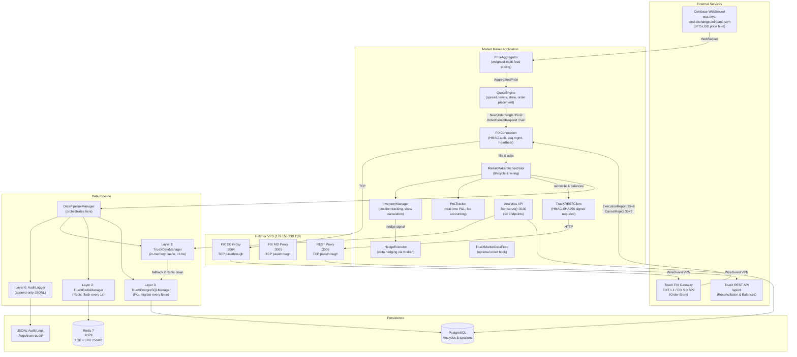
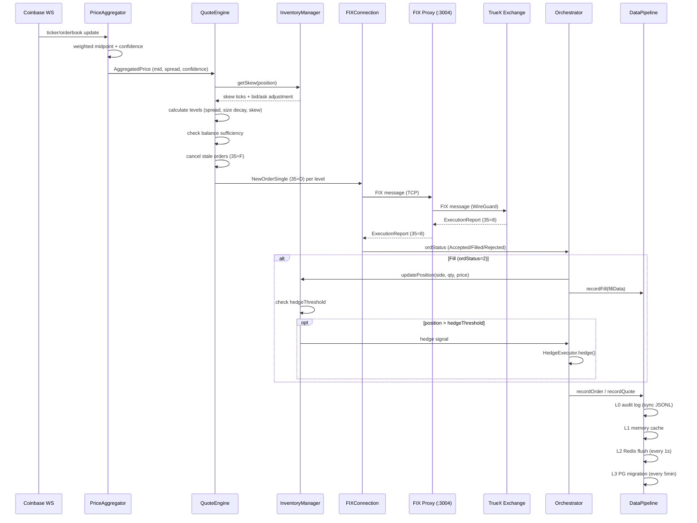
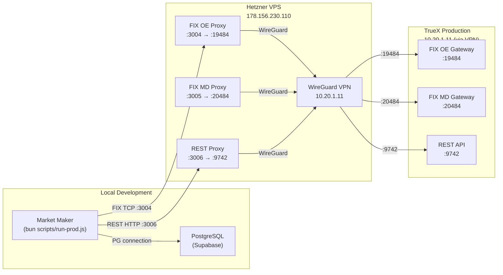

# TrueX Market Maker - Architecture

## System Overview

The TrueX Market Maker is an automated BTC-PYUSD market making system that posts two-sided quotes on the TrueX exchange using the FIX 5.0 SP2 protocol over FIXT.1.1 transport. It sources reference prices from Coinbase via WebSocket, applies inventory-aware skew and spread logic, and manages order lifecycle through a multi-tier data pipeline (Memory, Redis, PostgreSQL). The system runs on Bun, deploys via Docker Compose, and connects to TrueX production through a Hetzner-hosted FIX proxy over WireGuard VPN.

---

## Component Diagram

---

## Quote Cycle - Data Flow

---

## Deployment Topology

---

## Services

### MarketMakerOrchestrator
**File:** `src/core/market-maker-orchestrator.js`

The central coordinator that wires all components and manages the full lifecycle. Responsibilities:
- Creates and connects FIXConnection, QuoteEngine, InventoryManager, PnLTracker, HedgeExecutor
- Routes FIX execution reports (35=8) and cancel rejects (35=9) to the appropriate handlers
- Runs periodic reconciliation via REST (every 5 min) and balance refresh (every 1 min)
- Emits lifecycle events: `started`, `stopped`, `fill`, `hedge`, `error`, `emergency`

### QuoteEngine
**File:** `src/core/quote-engine.js`

Calculates and manages the two-sided quote ladder. Key parameters:
- `levels`: Number of price levels per side (default: 5, prod: 3)
- `baseSpreadBps`: Minimum spread in basis points (default: 50, prod: 80)
- `baseSizeBTC`: Order size at the top level (prod: 0.01 BTC)
- `sizeDecayFactor`: Each deeper level is this fraction of the previous (0.8)
- `minRepriceIntervalMs`: Throttle to prevent cancel/place storms (5000ms prod)
- `confidenceThreshold`: Minimum PriceAggregator confidence to quote (0.3)
- Balance-aware: checks available balances before posting orders

### FIXConnection
**File:** `src/fix-protocol/fix-connection.js`

FIX protocol client implementing FIXT.1.1 transport with FIX 5.0 SP2 application messages. Features:
- HMAC-SHA256 logon authentication
- Message sequence number management
- Heartbeat/TestRequest handling (30s interval)
- Automatic reconnection with exponential backoff
- Dual endpoint support: `TRUEX_UAT_OE` (order entry) and `TRUEX_UAT_MD` (market data)

### InventoryManager
**File:** `src/core/inventory-manager.js`

Tracks BTC position and computes quote skew. Parameters:
- `maxPositionBTC`: Hard position limit (prod: 0.05)
- `hedgeThresholdBTC`: Trigger hedging when position exceeds this (prod: 0.03)
- `maxSkewTicks` / `skewExponent`: Controls how aggressively quotes shift to reduce inventory
- `emergencyLimitBTC`: Emergency stop threshold (prod: 0.06)

### PnLTracker
**File:** `src/core/pnl-tracker.js`

Real-time P&L accounting with per-venue fee tiers:
- TrueX maker: 0 bps, taker: 10 bps
- Logs P&L summary every 30 seconds
- Tracks significant P&L changes for alerting

### HedgeExecutor
**File:** `src/core/hedge-executor.js`

Delta hedging engine that offloads inventory risk to Kraken (XBTUSD). Supports limit orders with configurable timeout fallback to market orders.

### PriceAggregator
**File:** `src/connectors/aggregator/PriceAggregator.ts`

Multi-exchange price feed combiner. Features:
- Weighted average pricing across Coinbase, Kraken, Gemini feeds
- Staleness detection per feed with configurable threshold
- Best bid/ask calculation across all venues
- Confidence score (0-1) based on number of active feeds
- Automatic failover when an exchange disconnects

Primary production feed: **Coinbase WebSocket** (BTC-USD).

### TrueXRESTClient
**File:** `src/exchanges/truex/TrueXRESTClient.ts`

REST API client for TrueX with HMAC-SHA256 authentication. Used for:
- Order reconciliation (comparing FIX state vs REST open orders)
- Balance and position queries
- Startup cleanup (cancelling orphaned orders before FIX session begins)

Auth signature: `HMAC-SHA256(apiSecret, timestamp + METHOD + /api/v1 + path)` encoded as base64. The `userId` header is the clientId (not apiKey).

### Analytics API
**Port:** 3100

Bun.serve()-based HTTP API exposing 14 endpoints for real-time monitoring, session stats, order history, P&L summaries, and health checks.

### FIX Proxy Server
**File:** `src/proxy/fix-proxy-server.js`
**Port:** 3004

TCP relay that forwards FIX messages from the market maker to TrueX. In production, this runs on a Hetzner VPS connected to TrueX via WireGuard VPN. In Docker Compose, it runs as a sidecar container.

---

## Storage

### PostgreSQL
- **Purpose:** Long-term analytics storage, session tracking, order/fill history
- **Connection:** `DATABASE_URL` env var (DigitalOcean managed in production)
- **Migration:** DataPipelineManager flushes from Redis/memory to PG every 5 minutes
- **Direct fallback:** When Redis is unavailable, flushes directly to PG every 5 seconds
- **Session records:** Created at session start and updated at session stop

### Redis
- **Purpose:** Fast intermediate persistence layer (Layer 2 of the data pipeline)
- **Image:** `redis:7-alpine` with AOF persistence
- **Config:** 256MB max memory, `allkeys-lru` eviction policy
- **Flush interval:** Every 1 second from in-memory cache
- **Health check:** PING with 5-second timeout; graceful degradation if unavailable
- **Connection:** `REDIS_URL` or `DO_REDIS_URL` env var

### Audit Logs (JSONL)
- **Purpose:** Append-only audit trail (Layer 0), synchronous writes
- **Location:** `./logs/truex-audit/`
- **Format:** One JSON object per line, timestamped

---

## External Integrations

| Integration | Protocol | Endpoint | Purpose |
|---|---|---|---|
| TrueX Order Entry | FIX 5.0 SP2 / FIXT.1.1 | `TRUEX_FIX_HOST:TRUEX_FIX_PORT` via proxy | Order placement (35=D), cancellation (35=F), execution reports (35=8) |
| TrueX REST API | HTTP + HMAC-SHA256 | `TRUEX_REST_URL/api/v1` (via proxy) | Order reconciliation, balance queries, startup cleanup |
| Coinbase | WebSocket | `wss://ws-feed.exchange.coinbase.com` | Real-time BTC-USD ticker and order book |
| Kraken | REST/WebSocket | Via HedgeExecutor | Delta hedging (XBTUSD) |

---

## Network & Security

### WireGuard VPN
TrueX requires VPN connectivity. A Hetzner VPS (178.156.230.110) runs a WireGuard tunnel to TrueX infrastructure (38.32.101.229). The FIX proxy and REST proxy on the VPS relay traffic through this tunnel.

### FIX Authentication
- **Protocol:** HMAC-SHA256 on the Logon (35=A) message
- **Credentials:** `TRUEX_API_KEY` (SenderSubID, tag 50 equivalent) + `TRUEX_API_SECRET`/`TRUEX_SECRET_KEY`
- **Party ID block:** Tag 453=1, tag 448=clientId, tag 452=3 required on all orders and cancels

### REST Authentication
- **Method:** HMAC-SHA256, base64-encoded
- **Signature payload:** `${timestamp}${METHOD}${path}` where path includes `/api/v1` prefix (no query string)
- **Headers:** `x-truex-auth-token` (apiKey), `x-truex-auth-signature`, `x-truex-auth-timestamp`, `x-truex-auth-userid` (clientId, NOT apiKey)

### Docker Security
- Non-root user (`nodejs:1001`) inside the container
- Production dependencies only (`bun install --production`)
- Structured JSON logging with size rotation

---

## Environment Variables

### Production (run-prod.js)

| Variable | Required | Description | Default |
|---|---|---|---|
| `TRUEX_PROD_API_KEY` | Yes | TrueX production API key (FIX tag 553 + REST auth) | — |
| `TRUEX_PROD_SECRET_KEY` | Yes | TrueX production secret (HMAC signing) | — |
| `TRUEX_CLIENT_ID` | Yes | TrueX client/user ID (party block tag 448) | `78932725357888855` |
| `TRUEX_FIX_HOST` | Yes | FIX proxy hostname or IP | `178.156.230.110` |
| `TRUEX_FIX_PORT` | Yes | FIX proxy port (OE) | `3004` |
| `TRUEX_TARGET_COMP_ID` | No | FIX TargetCompID | `TRUEX_PROD_OE` |
| `TRUEX_SENDER_COMP_ID` | No | FIX SenderCompID | `DAVID1` |
| `TRUEX_REST_URL` | Yes | REST proxy URL (via Hetzner) | `http://178.156.230.110:3006` |
| `DATABASE_URL` | No | PostgreSQL connection string | — |
| `REDIS_URL` | No | Redis connection URL | — |
| `LOG_LEVEL` | No | Logging verbosity (`info` or `debug`) | `info` |

### UAT (run-uat-paper-trading.js)

| Variable | Required | Description | Default |
|---|---|---|---|
| `TRUEX_API_KEY` | Yes | TrueX UAT API key | — |
| `TRUEX_SECRET_KEY` | Yes | TrueX UAT secret | — |
| `TRUEX_CLIENT_ID` | No | UAT client ID | `78972918929686546` |
| `TRUEX_FIX_HOST` | No | TrueX UAT host | `38.32.101.229` |
| `TRUEX_FIX_PORT` | No | TrueX UAT port | `19484` |
| `TRUEX_TARGET_COMP_ID` | No | FIX TargetCompID | `TRUEX_UAT_OE` |
| `TRUEX_REST_URL` | No | TrueX UAT REST URL | `http://38.32.101.229:9742` |
