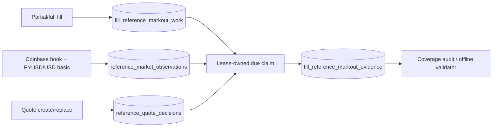

<!-- Generated from source code on 2026-08-17. Source is the single source of truth. -->
# Reference Mark-out Evidence

The reference mark-out path records evidence needed to evaluate market-making profitability. It
does not change quote prices or sizes, authorize a strategy, send FIX messages, or dispatch an
order. Failures are logged and counted without interrupting the market maker.

## Data flow



Each unique fill schedules configured horizons. The collector samples one immutable observation
per poll, then selects the earliest valid observation whose observation time is within the
horizon's due/deadline window. A fresh source tick may predate the due time, but it must not be
future-dated, stale, crossed, non-positive, or paired with future/stale/out-of-bounds basis data.
Coinbase BTC-USD is converted to BTC-PYUSD by dividing the midpoint by PYUSD/USD.

Claims use unique owner tokens and `FOR UPDATE OF work SKIP LOCKED`. An expired claim is recoverable
after process restart. Evidence is append-only and idempotent; before the deadline, unavailable
data releases the claim for retry, while after the deadline it becomes an explicit terminal reason.

## Production configuration

Collection is disabled unless `REFERENCE_MARKOUT_ENABLED` is explicitly true. Disabled mode does
not construct or start a collector and performs no sampling or mark-out writes. The normal
PostgreSQL initializer still creates the additive reference tables and indexes.

| Variable | Default | Meaning |
|---|---:|---|
| `REFERENCE_MARKOUT_ENABLED` | `false` | Enable collector and fill scheduling |
| `REFERENCE_MARKOUT_PRODUCT` | `BTC-USD` | Reference product; current collector accepts only this value |
| `REFERENCE_MARKOUT_QUOTE_CURRENCY` | `USD` | Reference quote currency |
| `REFERENCE_MARKOUT_SOURCE_EXCHANGE` | `coinbase` | Reference exchange |
| `REFERENCE_MARKOUT_SOURCE_TYPE` | `top-of-book` | Promotion-grade source type |
| `REFERENCE_MARKOUT_HORIZONS_MS` | `60000,300000,3600000` | Unique positive horizons |
| `REFERENCE_MARKOUT_MAX_SOURCE_AGE_MS` | `5000` | Maximum source and basis age at observation |
| `REFERENCE_MARKOUT_MAX_LATENESS_MS` | `30000` | Deadline extension after each horizon |
| `REFERENCE_MARKOUT_POLL_INTERVAL_MS` | `1000` | Open-window sampling/claim cadence; market rows are not written continuously when no unfinished horizon is open |
| `REFERENCE_MARKOUT_BATCH_SIZE` | `100` | Maximum claims per cycle |
| `REFERENCE_MARKOUT_CLAIM_LEASE_MS` | `5000` | Claim lease; must be at least the poll interval |
| `REFERENCE_MARKOUT_RETENTION_MS` | `7776000000` | Completed-evidence retention (90 days) |
| `REFERENCE_MARKOUT_RETENTION_SWEEP_INTERVAL_MS` | `3600000` | Retention cadence |
| `REFERENCE_MARKOUT_RETENTION_BATCH_SIZE` | `10000` | Maximum terminal rows removed by each bounded retention statement |
| `REFERENCE_MARKOUT_RETENTION_MAX_BATCHES_PER_SWEEP` | `12` | Maximum bounded statements per table and sweep; capacity is validated against observations, decisions, and planned fill horizon work |
| `REFERENCE_MARKOUT_MAX_QUOTE_DECISIONS_PER_SECOND` | `6` in production | Must equal the enforced QuoteEngine order-action rate; bounds quote-decision persistence only |
| `REFERENCE_MARKOUT_PLANNING_FILL_EVENTS_PER_SECOND` | `6` | Planning bound, not an execution limit. The read-only 2026-08-18 30-day sample had 935 fills, max 3/s, p99 2/s; 6/s supplies 2x observed burst headroom |
| `REFERENCE_MARKOUT_RETENTION_MAX_DURATION_MS` | `30000` | Total wall-time budget per independent retention sweep |
| `REFERENCE_MARKOUT_RETENTION_YIELD_MS` | `10` | Yield between full retention batches |
| `REFERENCE_MARKOUT_DB_STATEMENT_TIMEOUT_MS` | `2000` | Server-side timeout for reference persistence statements |
| `REFERENCE_MARKOUT_DB_QUERY_TIMEOUT_MS` | `2500` | Pool acquisition and each protocol step; must be at least statement timeout |
| `REFERENCE_MARKOUT_DB_LOCK_TIMEOUT_MS` | `500` | Lock wait bound; must not exceed statement timeout |
| `REFERENCE_MARKOUT_MAX_PENDING_DECISION_WRITES` | `100` | Bounded FIFO decision lane, validated against planned decision arrivals during the operation bound |
| `REFERENCE_MARKOUT_MAX_PENDING_FILL_WRITES` | `80` | Bounded FIFO priority fill lane; worst admitted wait is validated to fit before the earliest horizon |
| `REFERENCE_MARKOUT_WRITE_CONCURRENCY` | `4` | Maximum concurrent reference decision/fill writes |
| `REFERENCE_MARKOUT_MAX_CONSECUTIVE_FILL_STARTS` | `10` | Weighted-fair fill burst before one waiting decision must start; FIFO is preserved within each lane |
| `REFERENCE_MARKOUT_FILL_HORIZON_SAFETY_MARGIN_MS` | `1000` | Positive margin required after worst-case admitted fill service and before the earliest horizon |
| `REFERENCE_MARKOUT_AUDIT_MAX_GROUPS` | `500` | Maximum grouped audit rows |
| `REFERENCE_MARKOUT_MAX_ABS_BASIS_BPS` | `25` | Maximum absolute PYUSD/USD basis adjustment |
| `REFERENCE_MARKOUT_BASIS_SOURCE` | `kraken-pretrade` | Required promotion-grade basis source identity |
| `REFERENCE_MARKOUT_BASIS_REQUESTED_PAIR` | `PYUSD/USD` | Configured Kraken PreTrade request candidate |
| `REFERENCE_MARKOUT_BASIS_RESOLVED_PAIR` | `PYUSD/USD` | Exact resolved symbol accepted for promotion evidence |
| `REFERENCE_MARKOUT_BASIS_BASE` / `REFERENCE_MARKOUT_BASIS_QUOTE` | `PYUSD` / `USD` | Exact basis asset identity |
| `REFERENCE_MARKOUT_BASIS_SYSTEM` | `CLOB` | Exact market system identity |
| `REFERENCE_MARKOUT_BASIS_VENUE_ALLOWLIST` | none | Required comma-separated venue allowlist when enabled. Resolve from live PreTrade metadata; no MIC is hard-coded |
| `REFERENCE_MARKOUT_MAX_BASIS_RTT_MS` | `1000` | Maximum request-to-receipt duration; cannot exceed source age or poll timeout |

Invalid enabled configuration fails before production startup. Settings are not parsed while the
feature is disabled. Credentials remain in the existing ignored environment/secret mechanism;
never commit database URLs or exchange credentials.

`marketObservationsRecorded=0` and `lastMarketObservationAt=null` are healthy while
`openWindow=false` and `samplingState=idle-no-open-window`. Sampling occurs only while unfinished
durable horizon work is open. Queue/pool pressure, invalid-sample reasons, and retention backlog
remain visible in the authenticated status snapshot.

## Local verification

```bash
bun run test:reference-markouts
bun scripts/smoke-reference-markout-rollout-toggle.js
bun scripts/smoke-reference-markouts.js
```

The rollout smoke proves disabled mode creates no collector and enabled mode passes a validated
configuration unchanged. The restart smoke proves a durable one-minute observation completes after
a simulated restart with zero order/FIX capability.

## Coverage audit

```bash
bun scripts/report-reference-markout-coverage.js
bun scripts/report-reference-markout-coverage.js --from 1786924800000 --to 1787011199999 --limit 200
```

Output groups counts by side, quote level, policy ID, horizon, availability status, and explicit
reason. `pending`, `claimed`, missing attribution, stale data, and terminal unavailable evidence
remain distinct. The command is read-only apart from the manager's idempotent schema initializer.
Unknown flags or unsafe numeric bounds exit nonzero before opening a database connection.

## Staged rollout and rollback

1. Record the current production image identifier and confirm the normal rollback command.
2. Deploy with `REFERENCE_MARKOUT_ENABLED=false`.
3. Verify the effective image/config, PostgreSQL table/index creation, service health, FIX logon,
   acknowledged two-sided quotes, and no added rejects or quote gaps. The authenticated
   `GET /api/status` response must contain `referenceMarkouts: null`:
   `curl -sf -H "Authorization: Bearer ${ADMIN_API_TOKEN:?set locally}" http://localhost:3100/api/status`.
4. Capture `EXPLAIN (ANALYZE, BUFFERS)` for the read-only observation selector and plain `EXPLAIN`
   for each retention `DELETE` on production PostgreSQL before high-volume collection. Never run
   `EXPLAIN ANALYZE DELETE` outside an explicit transaction that is guaranteed to roll back.
5. Set `REFERENCE_MARKOUT_ENABLED=true`, recreate only the market-maker service, and verify collector
   evidence through authenticated `GET /api/status`: `referenceMarkouts.running` is true and
   `processCycles`/`lastCycleAt` advance. Only while `openWindow=true`, require
   both `marketObservationsRecorded` and `promotionGradeMarketObservationsRecorded` to increase and
   `lastMarketObservationAt` to remain current. While
   `openWindow=false`, `samplingState=idle-no-open-window`, zero observations, and a null last
   observation timestamp are healthy. `persistenceErrors`/the sanitized
   `lastErrorReason` do not trend upward. The top-level health status, quote presence, and FIX
   counters must remain unchanged by collection.
6. After eligible fills mature, run the bounded coverage audit and verify explicit 1/5/60-minute
   `promotion-grade` outcomes. `non-promotion-grade`/`legacy-missing-basis-provenance` rows remain
   diagnostic only. Do not promote a strategy from empty, pending, candle-only, legacy, or malformed evidence.

### Pre-enable evidence gate

Keep `REFERENCE_MARKOUT_ENABLED=false` until the reviewed image proves the bounded retention and
database isolation checks above and operators configure the observed Kraken PreTrade venue
explicitly. Promotion-grade basis rows retain requested/resolved pair, base/quote, venue, system,
request/receipt, and both side submission/publication timestamps. `basis_timestamp` is the older of
the two venue publication timestamps; receipt time is never relabeled as venue time. Legacy ticker
rows have nullable provenance and are intentionally excluded by the v3 selector.

Kraken's PreTrade response always needs a valid publication timestamp for every returned level;
`submission_ts` is treated as optional because official/live payload availability may vary. A
publication-only book is retained as diagnostic evidence with null submission fields and explicit
`missing-basis-submission-provenance` classification. Submission time is never inferred from
publication, request, or receipt, and the v3 selector cannot promote such a row.

To stop collection, set `REFERENCE_MARKOUT_ENABLED=false` and recreate the service. If the image or
schema change affects service health, restore the recorded prior image. Additive evidence tables may
remain; do not delete them during an incident, because deletion is unnecessary for rollback and can
destroy recoverable evidence.

PRD tasks 5.1 and 5.2 remain open until this live verification is complete.
