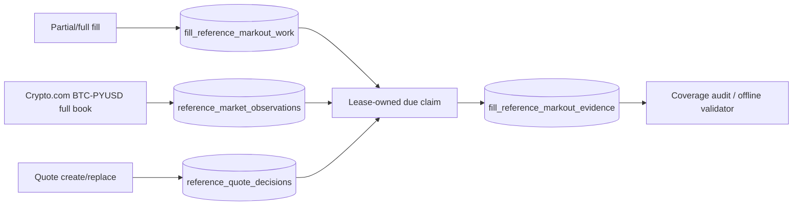

<!-- Generated from source code on 2026-08-17. Source is the single source of truth. -->
# Reference Mark-out Evidence

The reference mark-out path records evidence needed to evaluate market-making profitability. It
does not change quote prices or sizes, authorize a strategy, send FIX messages, or dispatch an
order. Failures are logged and counted without interrupting the market maker.

Promotion-grade collection is default-off and uses a dedicated Crypto.com public WebSocket
`book.BTC_PYUSD.10` full-snapshot feed. This feed is evidence-only: Coinbase remains the
pricing/quote anchor and the collector has no order or FIX capability. Configure the reviewed
`wss://` endpoint explicitly with `REFERENCE_MARKOUT_SOURCE_WS_URL`; do not enable collection
until the separate 30–60 minute source soak passes.

Message publication `t` is the point-in-time source timestamp and local callback receipt is
recorded separately. `tt` is retained as diagnostic last-book-update provenance and may be older
than `t`. Sequence, connection generation, and process-session identity are persisted. Missing,
stale, crossed, malformed, replayed, conflicting same-sequence, or disconnected books are
unavailable. Legacy Coinbase plus Kraken-basis rows remain diagnostic-only.

## Data flow



Each unique fill schedules configured horizons. The collector samples one immutable observation
per poll, then selects the earliest valid observation whose observation time is within the
horizon's due/deadline window. A fresh source snapshot may predate the due time, but it must not be
future-dated, stale, crossed, non-positive, replayed, or missing its validated book provenance.

Claims use unique owner tokens and `FOR UPDATE OF work SKIP LOCKED`. An expired claim is recoverable
after process restart. Evidence is append-only and idempotent; before the deadline, unavailable
data releases the claim for retry, while after the deadline it becomes an explicit terminal reason.

## Production configuration

Collection is disabled unless `REFERENCE_MARKOUT_ENABLED` is explicitly true. Disabled mode does
not construct or start a collector and performs no sampling or mark-out writes. The normal
PostgreSQL initializer still creates the additive reference tables and indexes.

| Variable | Default | Meaning |
|---|---:|---|
| `REFERENCE_MARKOUT_ENABLED` | `false` | Enable collector and fill scheduling |
| `REFERENCE_MARKOUT_REFERENCE_MODE` | `cryptocom-direct` | Direct BTC-PYUSD promotion path; legacy Coinbase+basis remains diagnostic |
| `REFERENCE_MARKOUT_PRODUCT` | `BTC-PYUSD` | Exact reference product |
| `REFERENCE_MARKOUT_QUOTE_CURRENCY` | `PYUSD` | Exact reference quote currency |
| `REFERENCE_MARKOUT_SOURCE_EXCHANGE` | `cryptocom` | Exact reference exchange identity |
| `REFERENCE_MARKOUT_SOURCE_TYPE` | `public-ws-book` | Promotion-grade full-book source type |
| `REFERENCE_MARKOUT_SOURCE_INSTRUMENT` | `BTC_PYUSD` | Exact Crypto.com instrument |
| `REFERENCE_MARKOUT_SOURCE_CHANNEL` | `book.BTC_PYUSD.10` | Exact snapshot subscription |
| `REFERENCE_MARKOUT_SOURCE_WS_URL` | none | Required exact official public market endpoint when enabled |
| `REFERENCE_MARKOUT_SOURCE_ENDPOINT_ALLOWLIST` | none | Required allowlist containing the exact configured official endpoint |
| `REFERENCE_MARKOUT_SOURCE_DEPTH` | `10` | Exact validated book depth |
| `REFERENCE_MARKOUT_SOURCE_RECONNECT_DELAY_MS` | `1000` | Bounded reconnect delay |
| `REFERENCE_MARKOUT_SOURCE_SUBSCRIBE_DELAY_MS` | `1000` | Generation-fenced delay after open before subscribe |
| `REFERENCE_MARKOUT_SOURCE_HEARTBEAT_TIMEOUT_MS` | `15000` | Half-open watchdog; must exceed subscribe delay and is bounded at startup |
| `REFERENCE_MARKOUT_SOURCE_RECONNECT_JITTER_MS` | `250` | Bounded reconnect jitter; cannot exceed reconnect delay |
| `REFERENCE_MARKOUT_HORIZONS_MS` | `60000,300000,3600000` | Unique positive horizons |
| `REFERENCE_MARKOUT_MAX_SOURCE_AGE_MS` | `5000` | Maximum source and basis age at observation |
| `REFERENCE_MARKOUT_MAX_LATENESS_MS` | `30000` | Deadline extension after each horizon |
| `REFERENCE_MARKOUT_POLL_INTERVAL_MS` | `1000` | Open-window sampling/claim cadence; market rows are not written continuously when no unfinished horizon is open |
| `REFERENCE_MARKOUT_BATCH_SIZE` | `100` | Maximum claims per cycle |
| `REFERENCE_MARKOUT_CLAIM_LEASE_MS` | `5000` | Claim lease; must be at least the poll interval |
| `REFERENCE_MARKOUT_RETENTION_MS` | `7776000000` | Completed-evidence retention (90 days) |
| `REFERENCE_MARKOUT_RETENTION_SWEEP_INTERVAL_MS` | `3600000` | Retention cadence |
| `REFERENCE_MARKOUT_RETENTION_BATCH_SIZE` | `10000` | Maximum terminal rows removed by each bounded retention statement |
| `REFERENCE_MARKOUT_RETENTION_MAX_BATCHES_PER_SWEEP` | `12` | Maximum bounded statements per table and sweep; capacity is validated against observations, decisions, and planned fill horizon work |
| `REFERENCE_MARKOUT_MAX_QUOTE_DECISIONS_PER_SECOND` | `6` in production | Must equal the enforced QuoteEngine order-action rate; bounds quote-decision persistence only |
| `REFERENCE_MARKOUT_PLANNING_FILL_EVENTS_PER_SECOND` | `6` | Planning bound, not an execution limit. The read-only 2026-08-18 30-day sample had 935 fills, max 3/s, p99 2/s; 6/s supplies 2x observed burst headroom |
| `REFERENCE_MARKOUT_RETENTION_MAX_DURATION_MS` | `30000` | Total wall-time budget per independent retention sweep |
| `REFERENCE_MARKOUT_RETENTION_YIELD_MS` | `10` | Yield between full retention batches |
| `REFERENCE_MARKOUT_DB_STATEMENT_TIMEOUT_MS` | `2000` | Server-side timeout for reference persistence statements |
| `REFERENCE_MARKOUT_DB_QUERY_TIMEOUT_MS` | `2500` | Pool acquisition and each protocol step; must be at least statement timeout |
| `REFERENCE_MARKOUT_DB_LOCK_TIMEOUT_MS` | `500` | Lock wait bound; must not exceed statement timeout |
| `REFERENCE_MARKOUT_MAX_PENDING_DECISION_WRITES` | `100` | Bounded FIFO decision lane, validated against planned decision arrivals during the operation bound |
| `REFERENCE_MARKOUT_MAX_PENDING_FILL_WRITES` | `80` | Bounded FIFO priority fill lane; worst admitted wait is validated to fit before the earliest horizon |
| `REFERENCE_MARKOUT_WRITE_CONCURRENCY` | `4` | Maximum concurrent reference decision/fill writes |
| `REFERENCE_MARKOUT_MAX_CONSECUTIVE_FILL_STARTS` | `10` | Weighted-fair fill burst before one waiting decision must start; FIFO is preserved within each lane |
| `REFERENCE_MARKOUT_FILL_HORIZON_SAFETY_MARGIN_MS` | `1000` | Positive margin required after worst-case admitted fill service and before the earliest horizon |
| `REFERENCE_MARKOUT_AUDIT_MAX_GROUPS` | `500` | Maximum grouped audit rows |
| `REFERENCE_MARKOUT_MAX_ABS_BASIS_BPS` | `25` | Legacy diagnostic basis bound; direct evidence has zero basis adjustment |
| `REFERENCE_MARKOUT_BASIS_SOURCE` | `kraken-pretrade` | Required promotion-grade basis source identity |
| `REFERENCE_MARKOUT_BASIS_REQUESTED_PAIR` | `PYUSD/USD` | Configured Kraken PreTrade request candidate |
| `REFERENCE_MARKOUT_BASIS_RESOLVED_PAIR` | `PYUSD/USD` | Exact resolved symbol accepted for promotion evidence |
| `REFERENCE_MARKOUT_BASIS_BASE` / `REFERENCE_MARKOUT_BASIS_QUOTE` | `PYUSD` / `USD` | Exact basis asset identity |
| `REFERENCE_MARKOUT_BASIS_SYSTEM` | `CLOB` | Exact market system identity |
| `REFERENCE_MARKOUT_BASIS_VENUE_ALLOWLIST` | none | Required only for the legacy Coinbase+basis diagnostic mode |
| `REFERENCE_MARKOUT_MAX_BASIS_RTT_MS` | `1000` | Maximum request-to-receipt duration; cannot exceed source age or poll timeout |

Invalid enabled configuration fails before production startup. Settings are not parsed while the
feature is disabled. Credentials remain in the existing ignored environment/secret mechanism;
never commit database URLs or exchange credentials.

## Minimal live-maker canary

`MM_MINIMAL_LIVE_CANARY_ENABLED=false` is the default. When explicitly enabled, this is the only
supported transition from observation to a first live maker test; it is not a general strategy
mode. It requires `MM_QUOTE_DISPATCH_MODE=live`, enabled direct reference mark-outs including the
60-second horizon, a PostgreSQL writer, and the exact fixed envelope below. Startup claims the
operator-provided run ID in PostgreSQL before any live quote can be sent, so a restart cannot reset
the elapsed-duration, fill, or mark-out controls. A new canary requires a newly approved ID.

| Variable | Requirement |
|---|---|
| `MM_MINIMAL_LIVE_CANARY_RUN_ID` | New 8–64 character, operator-approved, single-use ID |
| `MM_MINIMAL_LIVE_CANARY_DURATION_MS` | Positive and at most 900000 (15 minutes) |
| `MM_MINIMAL_LIVE_CANARY_MAX_CUMULATIVE_FILLED_BTC` | Positive cap of at least 0.001 BTC |

The quote envelope is fixed at one level per side, 0.0005 BTC per order, and 30–80 bps width.
The canary never enables taker execution or external hedging. It cancels and stops on a lost or
invalid TrueX EBBO, venue rejection/cancellation, missing or un-attributed 60-second mark-out,
negative 60-second mark-out, invalid fill-price evidence, fill-cap breach, or expiry. After the
first fill it does not replenish. Canary decisions and fills use policy ID
`minimal-live-canary-v1`, separate from observer telemetry.

`marketObservationsRecorded=0` and `lastMarketObservationAt=null` are healthy while
`openWindow=false` and `samplingState=idle-no-open-window`. Sampling occurs only while unfinished
durable horizon work is open. Queue/pool pressure, invalid-sample reasons, and retention backlog
remain visible in the authenticated status snapshot.

## Local verification

```bash
bun run test:reference-markouts
bun scripts/smoke-reference-markout-rollout-toggle.js
bun scripts/smoke-reference-markouts.js
```

The rollout smoke proves disabled mode creates no collector and enabled mode passes a validated
configuration unchanged. The restart smoke proves a durable one-minute observation completes after
a simulated restart with zero order/FIX capability.

## Coverage audit

```bash
bun scripts/report-reference-markout-coverage.js
bun scripts/report-reference-markout-coverage.js --from 1786924800000 --to 1787011199999 --limit 200
```

Output groups counts by side, quote level, policy ID, horizon, availability status, and explicit
reason. `pending`, `claimed`, missing attribution, stale data, and terminal unavailable evidence
remain distinct. The command is read-only apart from the manager's idempotent schema initializer.
Unknown flags or unsafe numeric bounds exit nonzero before opening a database connection.

## Staged rollout and rollback

1. Record the current production image identifier and confirm the normal rollback command.
2. Deploy with `REFERENCE_MARKOUT_ENABLED=false`.
3. Verify the effective image/config, PostgreSQL table/index creation, service health, FIX logon,
   acknowledged two-sided quotes, and no added rejects or quote gaps. The authenticated
   `GET /api/status` response must contain `referenceMarkouts: null`:
   `curl -sf -H "Authorization: Bearer ${ADMIN_API_TOKEN:?set locally}" http://localhost:3100/api/status`.
4. Capture `EXPLAIN (ANALYZE, BUFFERS)` for the read-only observation selector and plain `EXPLAIN`
   for each retention `DELETE` on production PostgreSQL before high-volume collection. Never run
   `EXPLAIN ANALYZE DELETE` outside an explicit transaction that is guaranteed to roll back.
5. Set `REFERENCE_MARKOUT_ENABLED=true`, recreate only the market-maker service, and verify collector
   evidence through authenticated `GET /api/status`: `referenceMarkouts.running` is true and
   `processCycles`/`lastCycleAt` advance. Only while `openWindow=true`, require
   both `marketObservationsRecorded` and `promotionGradeMarketObservationsRecorded` to increase and
   `lastMarketObservationAt` to remain current. While
   `openWindow=false`, `samplingState=idle-no-open-window`, zero observations, and a null last
   observation timestamp are healthy. `persistenceErrors`/the sanitized
   `lastErrorReason` do not trend upward. The top-level health status, quote presence, and FIX
   counters must remain unchanged by collection.
6. After eligible fills mature, run the bounded coverage audit and verify explicit 1/5/60-minute
   `promotion-grade` outcomes. `non-promotion-grade`/`legacy-missing-basis-provenance` rows remain
   diagnostic only. Do not promote a strategy from empty, pending, candle-only, legacy, or malformed evidence.

### Pre-enable evidence gate

Keep `REFERENCE_MARKOUT_ENABLED=false` until the reviewed image proves the bounded retention,
database isolation, exact effective Crypto.com endpoint configuration, and maker-isolation checks
above. Promotion-grade direct rows require the complete v4 Crypto.com provenance contract described
in this document. Legacy Coinbase observations and Kraken PreTrade basis rows remain readable
diagnostic evidence and are intentionally excluded by the v4 selector; no legacy timestamp or
caller-supplied promotion flag can substitute for direct-source attestation.

To stop collection, set `REFERENCE_MARKOUT_ENABLED=false` and recreate the service. If the image or
schema change affects service health, restore the recorded prior image. Additive evidence tables may
remain; do not delete them during an incident, because deletion is unnecessary for rollback and can
destroy recoverable evidence.

### Direct-source pre-enable soak (2026-08-18)

A 30-minute read-only `book.BTC_PYUSD.10` source soak captured 3,569 complete snapshots. Venue
publication age was 70ms p50, 155ms p95, and 1,326ms maximum; snapshot cadence was 503ms p50 and
575ms p95. The run handled 59 heartbeats and one bounded reconnect with zero malformed frames,
conflicting repeated sequences, sequence/timestamp regressions, or REST BBO mismatches across 30
comparisons. Repeated `u` occurred 3,484 times and always carried the identical canonical book and
`tt` with a newer `t`, matching the direct-source acceptance rule. This qualifies the source for a
separate default-off deployment and enabled observability canary; it is not profitability evidence
and does not authorize a strategy change.

PRD tasks 5.1 and 5.2 remain open until the separate production canary, eligible-fill coverage, and
multi-day profitability gates are complete.
